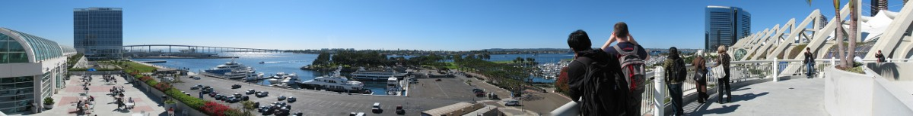
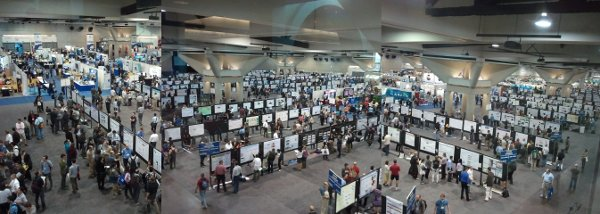
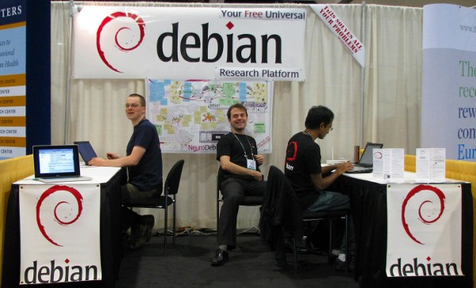
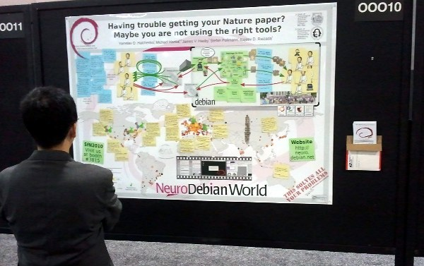

.. _chap_debian_booth_sfn2010:

Debian booth at SfN2010 in San Diego
====================================

During November 13-17, 2010 the NeuroDebian team ran its first Debian booth at the
annual meeting of the `Society for Neuroscience`_ (SfN2010_) in San
Diego, USA. We presented the upcoming release Debian 6.0 Squeeze and
demonstrated its utility as a robust and versatile research environment for
neuroscience. Booth visitors had the opportunity to meet with developers
of neuroscience research software, and to get information on available software
and recommendations for deployment strategies in research laboratories.

The `annual meeting`_ of the Society for Neuroscience is one of the largest
neuroscience conferences in the world, with over 30,000 attendees. Researchers,
clinicians, and leading experts discuss the latest findings about the brain,
nervous system, and related disorders.

Booth setup
-----------

`Don Armstrong`_ kindly provided us with Debian banners to decorate the
booth and some Debian T-shirts to give away. Moreover, we were equipped with
laptops running Debian squeeze and sid, as well as two additional laptops each
running a Debian squeeze virtual machine on top of Mac OS X and Windows,
respectively (CDs with the VM image were also available for visitors to take
home). To demonstrate Debian's versatility, we had a complete Debian
archive mirror that was used to show the full selection of available software
and the simplicity of installation and upgrade procedures.  The mirror
was provided from an external harddrive by a commodity router box
running the Debian-based DebWrt_ distribution.
All machines were connected to our own local wired network to avoid problems
with conference center's free wireless network (poor at best). Finally, we had
several hundred `tri-fold flyers`_ with general Debian facts on one side, and
NeuroDebian facts on the other (`sources are available`_).

   Final booth setup with staff (left to right): Michael Hanke, Yaroslav
   Halchenko and Swaroop Guntupali.

Booth visitors
--------------

The booth was well attended on all days of the conference. Many people were
somewhat surprised, but also pleased to see Debian represented. The visitors
comprised the whole range from long-term Debian users to people who were not
aware of an operating system other than Windows and Mac OS.

A number of visitors were involved in free software development -- at various
levels. We talked to a Debian ftpmaster, a Gentoo developer, various developers
of neuroscience-related software that is already integrated in Debian and many
more whose work still needs to be packaged.  We were visited by representatives of
companies looking for support to get their open-source products into Debian.
The vast majority, however, were scientists looking for a better research
platform for their labs. That included the struggling Phd-student, as well as
lab heads sharing their experience managing a computing infrastructure for
neuroscience research.

The Debian booth also served as a platform for upstream developers to meet with
Debian users of their software.

.. image:: pics/sfn2010/BusyBooth.jpg

Debian-based systems are the preferred Linux environment
--------------------------------------------------------

The overwhelming majority of visitors running some Linux flavor used a
Debian-based operating system -- including Debian_ itself, Ubuntu_ and
sidux/apttosid_. Especially people using Python for research purposes seem to
prefer the comprehensive support of Python modules in Debian, whereas e.g. R_
users are more uniformly distributed across GNU/Linux distributions. This
assessment is, of course, biased by the fact that Debian was the only
distribution that was present at this conference.

In general, we had the impression that Linux users employ a larger variety of
tools in their research activities, whereas users of proprietary operating
systems tended to limit themselves to a more restricted set, or use an
intermediate computing platform, such as Matlab.

   During the conference's poster session we explained the Debian system and
   community processes to many interested visitors (`download the poster`_).

Take-home messages
------------------

While there was a large variety of topics that were brought up by visitors there
were some common patterns.

Visibility

  For a Debian developer it may be surprising, but many people still do not
  know that Debian exists -- even despite the fact that Debian is often a
  perfect match for their particular requirements. People who got introduced to
  Debian at the booth often couldn't believe what they were hearing or
  seeing: so much software, runs on any hardware, all for free.

  We believe it would be very beneficial for Debian to reach out beyond the IT
  sector and present itself in all fields of applications that it already
  supports today.

Debian and Ubuntu

  Apparently it is still a largely unknown fact that Ubuntu is based on Debian.

Live-CD

  There was a significant demand for (customized) Live-CDs. On one hand, people
  were asking for a way to quickly try out Debian (and we believe that this
  doesn't necessarily have to be a live-cd). On the other hand, for example,
  teachers were asking for means to temporarily deploy Debian on, e.g.
  university computer pool machines and use Debian-packaged software for
  teaching courses (e.g. on brain-imaging data analysis).

Electrophysiology tools

  Of all subfields of neuroscience, electrophysiology researchers expressed the
  greatest demand for better tools in Debian -- or basically at least some
  specialized tools at all.  Moreover, many research projects relying
  on FOSS solutions in electrophysiology already use Debian-based
  systems to accomplish the mission; they just rely on manual (from sources)
  deployment of the necessary tools.  We started a `new Debian Science Blend task`_ to
  collect information about existing relevant software and to eventually package it.

Realtime capabilities

  Apparently, numerous research groups utilize Debian-based equipment to perform
  various flavors of real-time data acquisition and processing. They expressed
  their demand for real-time capabilities of (some) Debian kernel images.

Cloud-computing

  Cloud-computing seems to be an increasingly interesting topic for neuroscience
  data analysis. We got the impression that there is a tendency to look for
  alternatives to Matlab to be able to run analyses in the cloud cheaper (or at
  all). We pointed people to ongoing efforts in Debian to enable Debian-based
  cloud computing (see e.g. the `Debian wiki`_).

Many Thanks
-----------

Throughout the conference many people stopped by to express their gratitude to
Debian for developing their operating system of choice. We want to affirm this
and relay it to the larger Debian community. Thanks for Debian.

Acknowledgements
----------------

This booth has been made possible by the generous support of Prof. James V.
Haxby (Dartmouth College, New Hampshire, USA) and `other donations to the Debian
project`_.

.. _annual meeting: http://www.sfn.org/am2010/
.. _SfN2010: http://www.sfn.org/am2010/
.. _Society for Neuroscience: http://www.sfn.org/
.. _Don Armstrong: http://www.donarmstrong.org
.. _DebWrt: http://www.debwrt.net
.. _Debian: http://www.debian.org
.. _Ubuntu: http://www.ubuntu.com
.. _apttosid: http://aptosid.com
.. _R: http://www.r-project.org
.. _tri-fold flyers: http://neuro.debian.net/_files/brochure_debian-neurodebian.pdf
.. _sources are available: http://git.debian.org/?p=pkg-exppsy/neurodebian.git;a=tree;hb=HEAD;f=artwork/brochure
.. _Debian wiki: http://wiki.debian.org/Cloud
.. _new Debian Science Blend task: http://blends.alioth.debian.org/science/tasks/neuroscience-electrophysiology
.. _download the poster: http://neuro.debian.net/_files/NeuroDebian_SfN2010.png
.. _other donations to the Debian project: http://www.debian.org/donations
