==============================
 Supplementary survey results
==============================

.. note::

   The primary analyses have been published in:

     Hanke, M. & Halchenko, Y. O. (2011). `Neuroscience runs on GNU/Linux
     </_files/HankeHalchenko_FrontiersInNeuroinformatics2011.pdf>`_.
     *Frontiers in Neuroinformatics, 5:8*.

.. include:: figures/stats.txt

Submitter background
--------------------

The figures in this section provide some information on the background of the
participants in this survey: What data do they work with? Where are they coming
from? What is their position? Whom are they employed by?

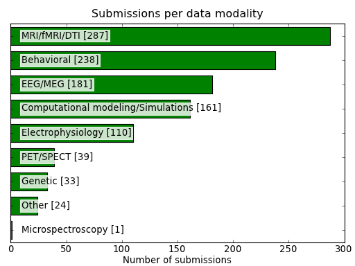
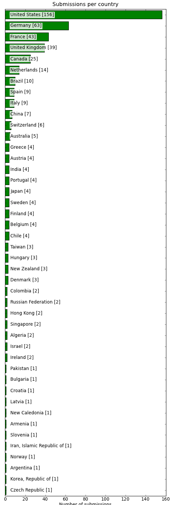
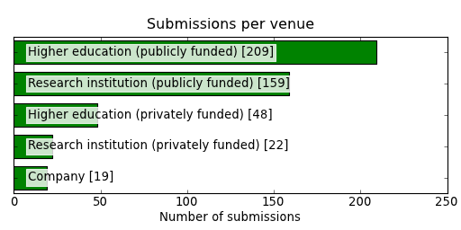
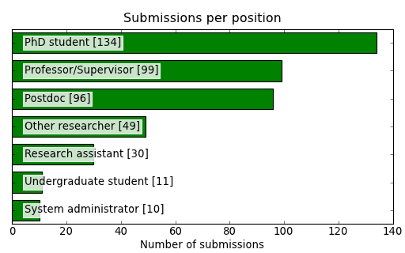

Scientific computing environment preferences
--------------------------------------------

This figures in this section expand the analysis on operating system environment
preference, and illustrate the results of the rating analysis reported in the
paper.

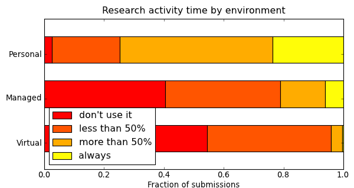
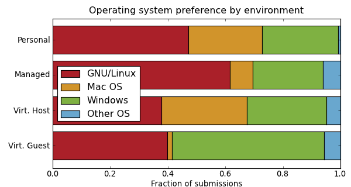

Rating analyses
~~~~~~~~~~~~~~~

The figures in this section show rating statistics grouped by the
respective operating system and use the same system color code
as in the figure above. The segments in each bar indicate the
frequency of individual rating options (from *definitely disagree* to
*definitely agree*) in up to four levels of color saturation.

Personal environment
^^^^^^^^^^^^^^^^^^^^

I prefer this particular scientific software environment because ...

.. raw:: html

   <table>
    <tr class="oddrow">
    <td>... the developers of an important research software recommend it </td>
    <td></td> </tr>
    <tr>
    <td> ... of the variety of available research software for this environment </td>
    <td></td> </tr>
    <tr class="oddrow">
    <td> ... of the availability of commercial support </td>
    <td></td> </tr>
    <tr>
    <td> ... many of my colleagues use something similar </td>
    <td></td> </tr>
    <tr class="oddrow">
    <td> ... it is popular and I can get solutions for problems from web forums and mailing lists </td>
    <td></td> </tr>
    <tr>
    <td> ... I rely on a particular application that runs in this environment only </td>
    <td></td> </tr>
    <tr class="oddrow">
    <td> ... it has adequate support for all required hardware </td>
    <td></td> </tr>
    <tr>
    <td> ... I have the necessary technical skills to maintain this environment myself </td>
    <td></td> </tr>
   </table>

Managed environment
^^^^^^^^^^^^^^^^^^^

I agree with the statements

.. raw:: html

   <table>
    <tr class="oddrow">
    <td> This environment provides me with the best available tools for my research </td>
    <td></td> </tr>
    <tr>
    <td> The support staff solves all my technical problems and addresses my demands in a timely fashion </td>
    <td></td> </tr>
    <tr class="oddrow">
    <td> There are always enough licenses for essential commercial software tools </td>
    <td></td> </tr>
    <tr>
    <td> I need to deploy additional software to be able to perform my research in this environment </td>
    <td></td> </tr>
   </table>

Virtual environment (by host OS)
^^^^^^^^^^^^^^^^^^^^^^^^^^^^^^^^

I agree with the statements

.. raw:: html

   <table>
    <tr class="oddrow">
    <td> I can run software that is otherwise incompatible with my system </td>
    <td></td> </tr>
    <tr>
    <td> I have the ability to easily create a snapshot of my whole analysis environment </td>
    <td></td> </tr>
    <tr class="oddrow">
    <td> I can take my complete analysis environment with me and run it on different machines </td>
    <td></td> </tr>
   </table>

Virtual environment (by guest OS)
^^^^^^^^^^^^^^^^^^^^^^^^^^^^^^^^^

I agree with the statements

.. raw:: html

   <table>
    <tr class="oddrow">
    <td> I can run software that is otherwise incompatible with my system </td>
    <td></td> </tr>
    <tr>
    <td> I have the ability to easily create a snapshot of my whole analysis environment </td>
    <td></td> </tr>
    <tr class="oddrow">
    <td> I can take my complete analysis environment with me and run it on different machines </td>
    <td></td> </tr>
   </table>

Software resources
------------------

This section reports the results on where the survey participants obtain their
research software from/

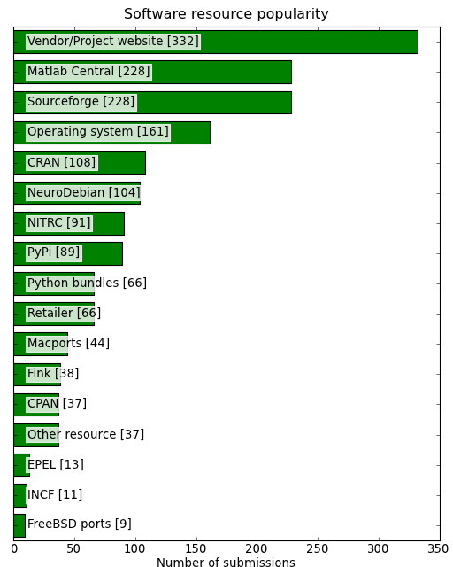

Software popularity
-------------------

The section on software popularity shows what software participants indicated to
be using in their research activities -- group by field of application.

.. note:: :sup:`†` Entries which were either entered in "Other"
   field or were added to the survey form while survey was already running.

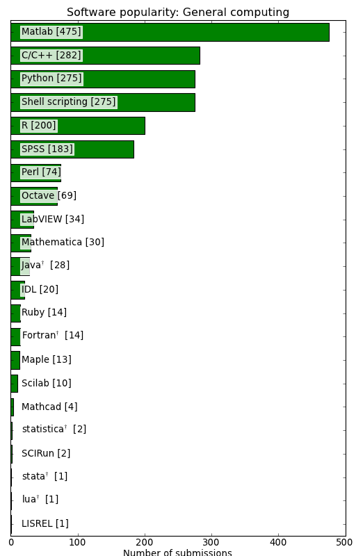
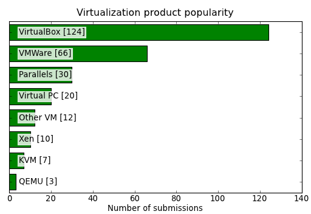
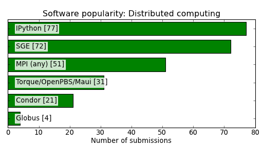
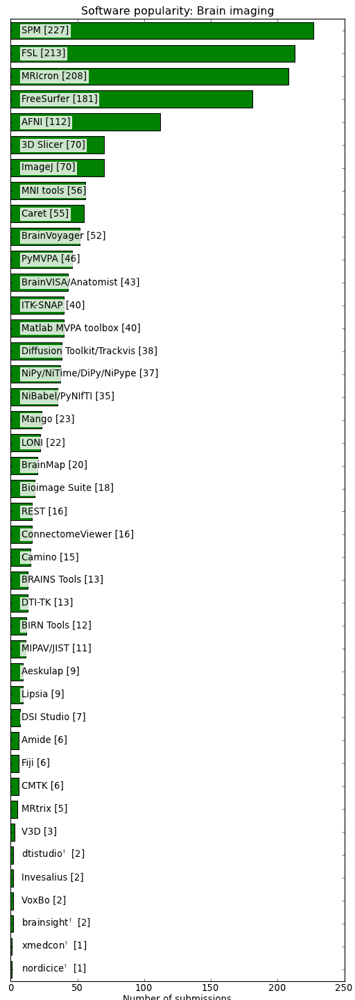
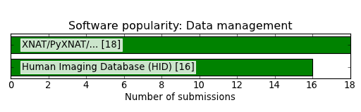
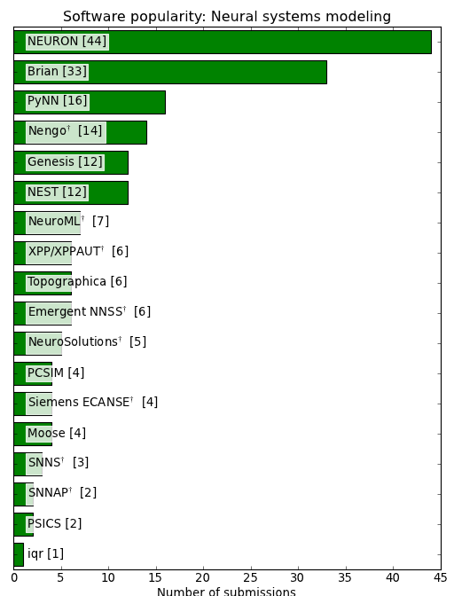
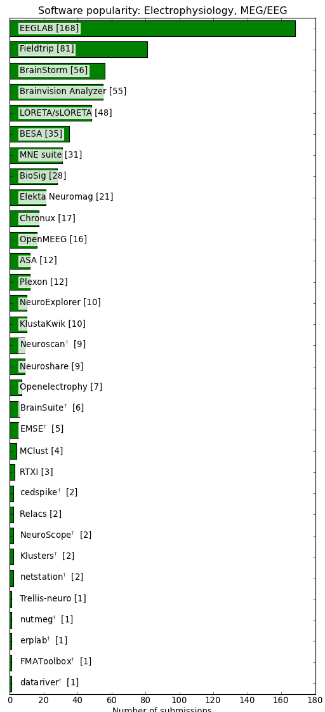
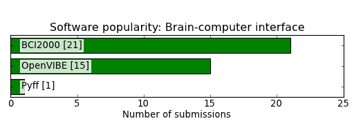
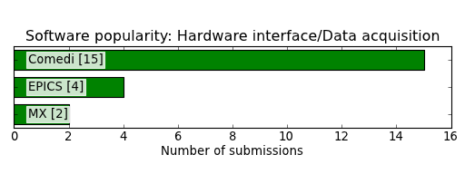
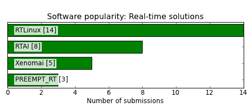
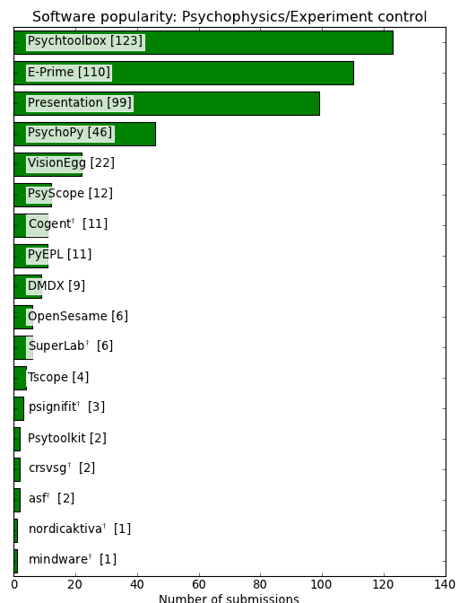

.. note:: :sup:`†` Entries which were either entered in "Other"
   field or were added to the survey form while survey was already running.

