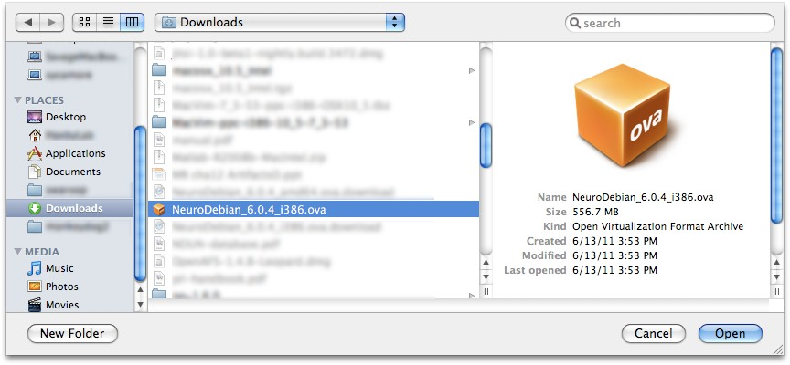
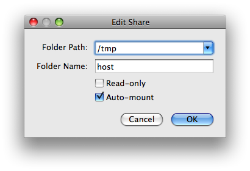
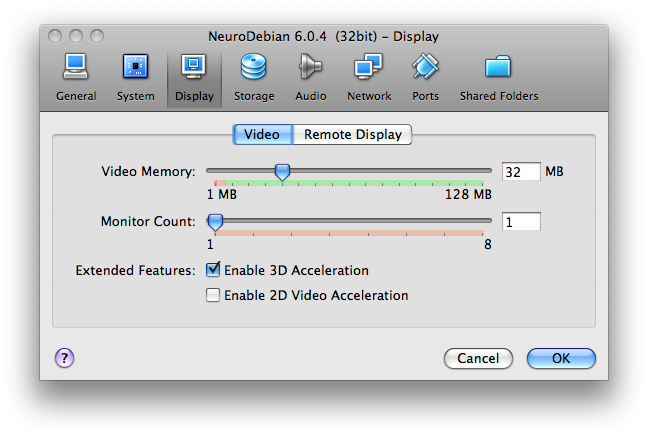
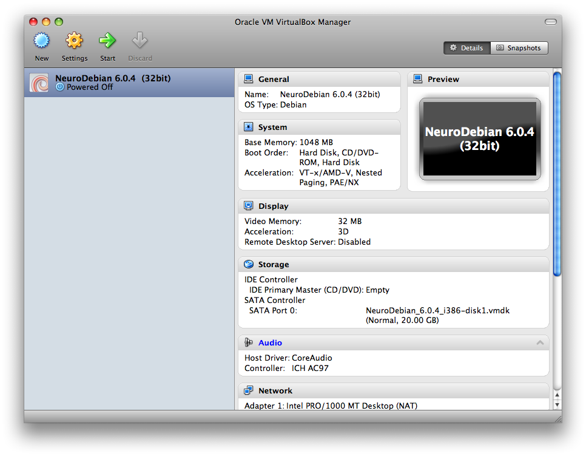

.. _chap_vm:

NeuroDebian Virtual Machine
===========================

.. quotes::
   :random: 1
   :tags: vm

For those who are not yet running a Debian-based operation system we offer a
`virtual machine`_ that can be used with `VirtualBox`_, allowing users to benefit
from a Debian-based research environment on other operating systems.
This virtual machine initially comes as a compact Debian installation that can,
once installed, be equipped with a large variety of neuroscience software with
just a few mouse clicks (e.g. AFNI_, Caret_, FSL_, PyMVPA_).

.. _virtual machine: http://en.wikipedia.org/wiki/Virtual_machine
.. _AFNI: http://afni.nimh.nih.gov/afni/
.. _Caret: http://brainvis.wustl.edu/wiki/index.php/Caret:About
.. _FSL: http://www.fmrib.ox.ac.uk/fsl/
.. _PyMVPA: http://www.pymvpa.org

Downloads
---------

* `NeuroDebian 6.0.4 image (32bit)
  <http://neuro.debian.net/debian/vm/NeuroDebian_6.0.4_i386.ova>`_ [~558MB]

  *This image should work on virtually all systems that are supported by*
  VirtualBox_ *and can be used whenever the, otherwise preferable, 64bit image
  is not compatible with a host machine.*

* `NeuroDebian 6.0.4 image (64bit)
  <http://neuro.debian.net/debian/vm/NeuroDebian_6.0.4_amd64.ova>`_ [~573MB]

  *This image only works on 64bit host machines with active hardware
  virtualization support. The should include all recent Apple hardware and most
  64bit Windows systems.*

Virtual appliances above carry guest additions for 4.x series of the
VirtualBox. If you still have VirtualBox 3.x, use previous 6.0.2
virtual appliances:

* `NeuroDebian 6.0.2 image (32bit)
  <http://neuro.debian.net/debian/vm/neurodebian_6.0.2_i386.zip>`_ [~545MB]

* `NeuroDebian 6.0.2 image (64bit)
  <http://neuro.debian.net/debian/vm/neurodebian_6.0.2_amd64.zip>`_ [~560MB]

.. note::

  This older virtual appliances are distributed as a `zip` file. Please
  extract all files from the `.zip` file, using appropriate software
  for your operating system.

.. note::

  You can verify that you have downloaded archives correctly using
  `md5sums -c MD5SUMS
  <http://neuro.debian.net/debian/vm/MD5SUMS>`_ . You can also verify
  the authenticity of the `MD5SUMS
  <http://neuro.debian.net/debian/vm/MD5SUMS>`_ itself using `gpg
  --verify MD5SUMS.gpg
  <http://neuro.debian.net/debian/vm/MD5SUMS.gpg>`_ signed with
  NeuroDebian archive key.

* `VirtualBox download page <http://www.virtualbox.org/wiki/Downloads>`_ (Windows, Linux, Mac,
  Solaris)

  *This webpage offers installers of the VirtualBox application, as well as the
  documentation.*

Changes
-------

6.0.4 -- 13 Jun 2011

      * Updated shipped virtualbox-ose guest-utils and guest-x11 to 4.0.4

6.0.3 -- 12 Jun 2011 [Superseded in the archive by 6.0.4]

      * Updated to Squeeze 6.0.1
      * Updated VirtualBox guest additions to 4.0.4 from backports.debian.org
      * Appliance is available as a single file (.ova) ready for the import

6.0.2 -- 08 Feb 2011

6.0.1 -- 01 Dec 2010

Documentation
-------------

The virtual machine contains an installation of `Debian 6.0 (squeeze)`_ with a
GNOME_ desktop environment. All installed software comes from standard Debian
packages, or prospective Debian packages from NeuroDebian. This means that all
contained software is readily available for any system running a Debian
operating system (or a recent Ubuntu release). The virtual machine can be seen
as a showcase of what Debian for neuroscience research feels like. Moreover,
once downloaded this virtual machine can be kept up to date, just as any other
Debian installation. Using convenient graphical package management tools users
will benefit from security bug fixes provided by the Debian project for the
whole operating system, as well as from software updates for
neuroscience-related packages.

.. _Debian 6.0 (squeeze): http://www.debian.org/releases/squeeze
.. _GNOME: http://www.gnome.org/

Installation
~~~~~~~~~~~~

The following video shows how to get the NeuroDebian virtual machine running
on your machine. The installation is shown for Mac OS X. It should, however, be
very similar on a Windows box. If you cannot watch the video, please take a
look at the written instructions below.

.. raw:: html

  <iframe title="YouTube video player"
          class="youtube-player"
          type="text/html"
          width="640"
          height="375"
          src="http://www.youtube.com/embed/eqfjKV5XaTE?hd=1"
          frameborder="0"></iframe>

First download and install a recent version of VirtualBox_. VirtualBox is a
virtualization software that is freely available for Windows, MacOS X, Solaris,
and Linux. VirtualBox comes with a comprehensive manual that should answer
potential questions regarding installation and maintenance.

.. _VirtualBox: http://www.virtualbox.org

Next, download the most recent version of the NeuroDebian virtual machine from
the Downloads_ section.  Start VirtualBox and select "Import Appliance" from the file
menu.

.. image:: pics/vm_import_app.jpg

The next dialog will ask you to choose a virtual machine. Please navigate to the
extracted NeuroDebian download and select the `.ova` (or extracted
`.ovf` for older appliances shipped as `.zip`) file.

You can finish importing of NeuroDebian by clicking on *next* a couple of
times.  There is no need to change anything, as we will get through the
settings in a second.  Importing of the virtual machine will take a short
while, as it is distributed in a compressed format that now gets extracted
(total extracted size about 2 GB).  Once imported, the NeuroDebian virtual
machine will appear in the list of available machines. Do **not** start it yet,
but select NeuroDebian and hit the *Settings* button. In the following dialog
you'll have a chance to configure the machine. You can assign the amount of RAM
that should be made available to it (for serious fMRI data processing, please
allow at least 2 GB). If you have a recent computer with multiple CPU cores,
you can also decide how many cores should be used by the virtual machine.

.. image:: pics/vm_add_host_folder.jpg

However, most important is the *Shared Folders* setup. Shared folders allow the
virtual machine to access the local harddrive of the host computer. This is an
easy way to access data on the computer without duplicating it or using the
network to access it. The virtual machine is preconfigured to access a shared
folder named labeled "host".  Click on the *add* button to select a folder that
shall be accessible by the machine (e.g. your home directory) and put "host" as
the folder name and mark it to be auto-mounted. Note, the folder name is simply a label. Your directory will
not be renamed.

If you have a large screen you should increase the display memory to
32 MB in the *Display* settings.  Also you might like to enable the
support for 3D Acceleration

Finally, close the settings dialog. You have now completed the setup, and you
can start the virtual machine by hitting the *Start* button. A new window will
appear showing the boot process. After a short while the NeuroDebian desktop
will appear, and a setup wizard will guide your through the final steps of the
configuration. You can now explore the system. The virtual machine is connected
with your host computer, and shares its Internet connection. Via this
connection you can update the contained software packages at any time.

The virtual machine logs yourself in automatically. The name of the virtual
machine user is `brain` and the password is `neurodebian`. The *root* password
is also `neurodebian`. In most cases, however, you should not be forced to type
the password, since `sudo` is configured to work without it.

.. note::

  For increased security you might want to change the default password. You can
  do so by opening a terminal window and running the ``passwd`` command.

Working with the virtual machine
~~~~~~~~~~~~~~~~~~~~~~~~~~~~~~~~

The next video is a demonstration of some basic desktop integration features.
It shows how to use the virtual machine in full-screen and seamless mode, shared
folder access, software installation, as well as suspending and resuming the
virtual machine.

.. raw:: html

  <iframe title="YouTube video player"
          class="youtube-player"
          type="text/html"
          width="640"
          height="375"
          src="http://www.youtube.com/embed/OV7fYSEoOeQ?hd=1"
          frameborder="0"></iframe>

.. _chap_vm_troubleshooting:

Troubleshooting
~~~~~~~~~~~~~~~

Updating the VM or installing new packages doesn't work.

  The VM uses as service that tries to figure out the best/closest package
  repository for you. In some network environments this service might not work
  well, or not at all. To check if this is a problem, you can modify the
  respective configuration by hand. Edit ``/etc/apt/sources.list`` (you need to
  use ``sudo`` for that) and replace the package repository URL with a mirror
  close to you. A comprehensive list of mirrors is available at:
  http://www.debian.org/mirror/list

  Pick one and replace all ``geomirror.debian.net`` URLs with the new mirror
  URL. For example, in Canada you might want to change::

    deb http://i386-geomirror.debian.net/debian squeeze main non-free contrib

  to::

    deb http://ftp.ca.debian.org/debian/ squeeze main non-free contrib

  Only modify lines that refer to ``geomirror`` (all of them), but do **not**
  modify entries for ``security.debian.org``.

I cannot hear sounds played in the virtual machine.

  By default the sound is muted. To enable playback launch the mixer applet by
  clicking on the mixer icon in the task bar. Unmute the master volume control.
  Now click on the "Volume control" to load the channel mixer dialog. Unmute
  the "Master" and "PCM" channels and raise the volume as desired. You should
  now be able to hear sounds played within the virtual machines through your
  host computer's speakers.

I have upgraded VirtualBox from 3.x series to 4.x, and my VM lost
mounted host directories.

  NeuroDebian VMs prior 6.0.3 were shipped with guest additions from
  3.x series of VirtualBox and some initial versions of VirtualBox in
  4.x series have failed to mount host directories properly.
  VirtualBox 4.0.8 seems to work fine with guest additions from 3.x
  series.  If you nevertheless want to upgrade guest additions within
  NeuroDebian VM, please rebuild the version available from the
  backports::

    sudo apt-get install -y linux-headers-2.6-amd64 # or -686 for 32bit
    sudo apt-get install -y -t squeeze-backports virtualbox-ose-guest-kdms \
         virtualbox-ose-guest-utils  virtualbox-ose-guest-x11

  and reboot VM.
