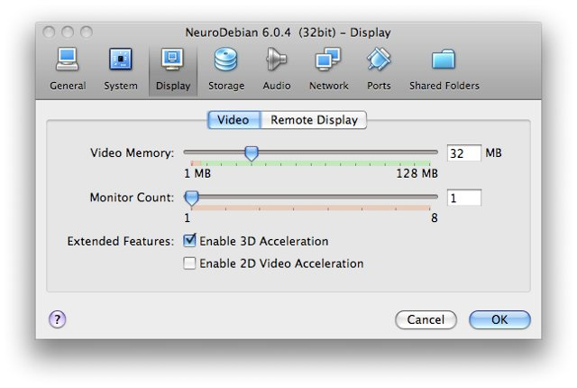

.. _chap_vm:

NeuroDebian Virtual Machine
===========================

`Installation`_ | `Working with the virtual machine`_ | `Troubleshooting`_ |
`What has changed`_

.. quotes::
   :random: 1
   :tags: vm

For all systems running a non-Debian-based operation system, such as MS Windows
or Mac OS X, we offer a `virtual machine`_ that can be equipped with a large
variety of neuroscience software with just a few mouse clicks (e.g. AFNI_,
FSL_, PyMVPA_).

.. _virtual machine: http://en.wikipedia.org/wiki/Virtual_machine

The virtual machine contains an installation of `Debian 7.0 (wheezy)`_ with a
GNOME_ desktop environment. All installed software comes from standard Debian
packages, or prospective Debian packages from NeuroDebian. The virtual machine
can be seen as a showcase of what Debian for neuroscience research feels like.
Once downloaded this virtual machine can be kept up to date, just as any other
Debian installation. Using convenient graphical package management tools users
will benefit from security bug fixes provided by the Debian project for the
whole operating system, as well as from software updates for
neuroscience-related packages.

Even on Debian-based systems this virtual machine is an excellent way to
maintain an analysis environment that remains identical throughout the lifetime
of a study and that can be archived alongside acquired data and publications.
This is a much more practical way than freezing the entire software stack of a
whole workstation, where it quickly becomes troublesome to combine the desire
for latest research methodology for new studies and the need for stability for
ongoing projects.

Installation
~~~~~~~~~~~~

The following instructions demonstrate how to install the NeuroDebian virtual
machine -- here shown exemplary for Mac OS X, but the procedure is virtually
identical on a Windows box. There is also a video tutorial at coffee break
length. `[Virtual machine setup video tutorial]
<http://www.youtube.com/watch?v=eqfjKV5XaTE>`_.

If you don't have t already, first download and install a recent version of
VirtualBox_. VirtualBox is a virtualization software that is freely available
for Windows, MacOS X, Solaris, and Linux. VirtualBox comes with a comprehensive
manual that should answer potential questions regarding installation and
maintenance.

.. _VirtualBox: http://www.virtualbox.org

Obtain the most recent version of the NeuroDebian virtual machine by visiting
http://neuro.debian.net and selecting your operating system and a download
server on the frontpage.

Start VirtualBox and select "Import Appliance" from the file menu.

.. image:: pics/vm_import_app.jpg

The next dialog will ask you to choose a virtual machine. Please navigate to the
extracted NeuroDebian download and select the `.ova` (or extracted
`.ovf` for older appliances shipped as `.zip`) file.

.. image:: pics/vm_import_wizard.jpg

You can finish importing of NeuroDebian by clicking on *next* a couple of
times.  There is no need to change anything, as we will get through the
settings in a second.  Importing of the virtual machine will take a short
while, as it is distributed in a compressed format that now gets extracted
(total extracted size about 2 GB).  Once imported, the NeuroDebian virtual
machine will appear in the list of available machines. Do **not** start it yet,
but select NeuroDebian and hit the *Settings* button. In the following dialog
you'll have a chance to configure the machine. You can assign the amount of RAM
that should be made available to it (for serious fMRI data processing, please
allow at least 2 GB). If you have a recent computer with multiple CPU cores,
you can also decide how many cores should be used by the virtual machine.

.. image:: pics/vm_add_host_folder.jpg

However, most important is the *Shared Folders* setup. Shared folders allow the
virtual machine to access the local harddrive of the host computer. This is an
easy way to access data on the computer without duplicating it or using the
network to access it. The virtual machine is preconfigured to access a shared
folder named labeled "host".  Click on the *add* button to select a folder that
shall be accessible by the machine (e.g. your home directory) and put "host" as
the folder name and mark it to be auto-mounted. Note, the folder name is simply a label. Your directory will
not be renamed.

.. image:: pics/vm_host_folder.jpg

If you have a large screen you should increase the display memory to
32 MB in the *Display* settings.  Also you might like to enable the
support for 3D Acceleration

Finally, close the settings dialog. You have now completed the setup, and you
can start the virtual machine by hitting the *Start* button. A new window will
appear showing the boot process. After a short while the NeuroDebian desktop
will appear, and a setup wizard will guide your through the final steps of the
configuration. You can now explore the system. The virtual machine is connected
with your host computer, and shares its Internet connection. Via this
connection you can update the contained software packages at any time.

.. image:: pics/vm_settings.jpg

The virtual machine logs yourself in automatically. This is the default account:

:user: brain
:password: neurodebian

:root password: neurodebian

In most cases you should not be forced to type the password, because ``sudo``
is configured to work without it.

.. note::

  For increased security you might want to change the default password. You can
  do so by opening a terminal window and running the ``passwd`` command.

Working with the virtual machine
~~~~~~~~~~~~~~~~~~~~~~~~~~~~~~~~

The NeuroDebian virtual machine has very low maintenance demands. We have
prepared a short video demo that shows most typical procedures that you will
probably perform while working with NeuroDebian inside a virtual machine:
use the virtual machine in full-screen and seamless mode, shared folder access,
software installation, as well as suspending and resuming the
virtual machine. `[Virtual machine handling video tutorial]
<http://www.youtube.com/watch?v=OV7fYSEoOeQ>`_

.. _chap_vm_troubleshooting:

Troubleshooting
~~~~~~~~~~~~~~~

.. container:: foldup

  .. container:: expandinstructions

     Click on an item to expand it

  Updating the VM or installing new packages doesn't work
    The VM uses as service that tries to figure out the best/closest package
    repository for you. In some network environments this service might not work
    well, or not at all. To check if this is a problem, you can modify the
    respective configuration by hand. Edit ``/etc/apt/sources.list`` (you need
    to use ``sudo`` for that) and replace the package repository URL with a
    mirror close to you. A comprehensive list of mirrors is available at:
    http://www.debian.org/mirror/list

    Pick one and replace all ``geomirror.debian.net`` URLs with the new mirror
    URL. For example, in Canada you might want to change::

      deb http://i386-geomirror.debian.net/debian squeeze main non-free contrib

    to::

      deb http://ftp.ca.debian.org/debian/ squeeze main non-free contrib

    Only modify lines that refer to ``geomirror`` (all of them), but do **not**
    modify entries for ``security.debian.org``.

  Our proxy setup at work prevents APT from downloading packages
    APT needs to be told how to access the proxy. Talk to your local sysadmin
    and ask for the proxy's address (maybe a username and password too), as well
    as the ports for HTTP and FTP proxies. With this information add the
    following lines in the file, /etc/apt/apt.conf.d/80proxy. This will ensure
    that after an upgrade changes won't be lost::

      Acquire::http::proxy "http://<username>:<password>@<proxy>:<port>/";
      Acquire::ftp::proxy "ftp://<username>:<password>@<proxy>:<port>/";
      Acquire::https::proxy "https://<username>:<password>@<proxy>:<port>/";

  I cannot hear sounds played in the virtual machine
    By default the sound is muted. To enable playback launch the mixer applet by
    clicking on the mixer icon in the task bar. Unmute the master volume
    control. Now click on the "Volume control" to load the channel mixer dialog.
    Unmute the "Master" and "PCM" channels and raise the volume as desired. You
    should now be able to hear sounds played within the virtual machines through
    your host computer's speakers.

  My VM lost mounted host directories after upgrading from VirtualBox from 3.x to 4.x
    NeuroDebian VMs prior 6.0.3 were shipped with guest additions from
    3.x series of VirtualBox and some initial versions of VirtualBox in
    4.x series have failed to mount host directories properly.
    VirtualBox 4.0.8 seems to work fine with guest additions from 3.x
    series.  If you nevertheless want to upgrade guest additions within
    NeuroDebian VM, please rebuild the version available from the
    backports::

      sudo apt-get install -y linux-headers-2.6-amd64 # or -686 for 32bit
      sudo apt-get install -y -t squeeze-backports virtualbox-ose-guest-dkms \
           virtualbox-ose-guest-utils  virtualbox-ose-guest-x11

    and reboot VM.

  I am still running an older VirtualBox 3.x
    Download one of the image files listed below. These older releases
    are distributed as a `zip` file. Please extract all files from the
    `.zip` file, using appropriate software for your operating system.

    * `NeuroDebian 6.0.2 image (32bit)
      <http://neuro.debian.net/debian/vm/neurodebian_6.0.2_i386.zip>`_ [~545MB]

    * `NeuroDebian 6.0.2 image (64bit)
      <http://neuro.debian.net/debian/vm/neurodebian_6.0.2_amd64.zip>`_ [~560MB]

What has changed
----------------

.. container:: foldup

  .. container:: expandinstructions

     Click on an item to expand it

  7.0.0 -- 15 May 2013
    * VM appliance based on the official wheezy release.
    * Uses xfce4-terminal by default (instead of urxvt/rxvt-unicode as
      in beta-releases)

  6.999.b4.20130421 -- 22 Apr 2013
    * Refreshed VM appliance to avoid lengthy initial upgrade

  6.999.b4.20121231 -- 31 Dec 2012
    * Based on beta 4 release of debian-installer_ for wheezy
    * Comes with XFCE4_ instead of GNOME_

  6.0.6 -- 01 Oct 2012
    * Updated core system to Debian squeeze 6.0.6

  6.0.5 -- 10 Nov 2011
    * Updated core system to Debian squeeze 6.0.3
    * Updated shipped virtualbox-ose guest-utils and guest-x11 to 4.0.10

      - ``~/host`` is now symlinked to correct path ``/media/sf_host``
      - ``brain`` user is added to ``vboxsf`` group so mounted host
        directories should become readily available

    * Root partition size and swap space got doubled in size (40GB
      and 2GB correspondingly).  Space is allocated dynamically so
      the actual size of the virtual drive should not grow unless
      you use it

  6.0.4 -- 13 Jun 2011
    * Updated shipped virtualbox-ose guest-utils and guest-x11 to 4.0.4

  6.0.3 -- 12 Jun 2011 [Superseded in the archive by 6.0.4]
    * Updated to Squeeze 6.0.1
    * Updated VirtualBox guest additions to 4.0.4 from backports.debian.org
    * Appliance is available as a single file (.ova) ready for the import

  6.0.2 -- 08 Feb 2011
    * Minor update

  6.0.1 -- 01 Dec 2010
    * Minor update

.. include:: link_names.txt
